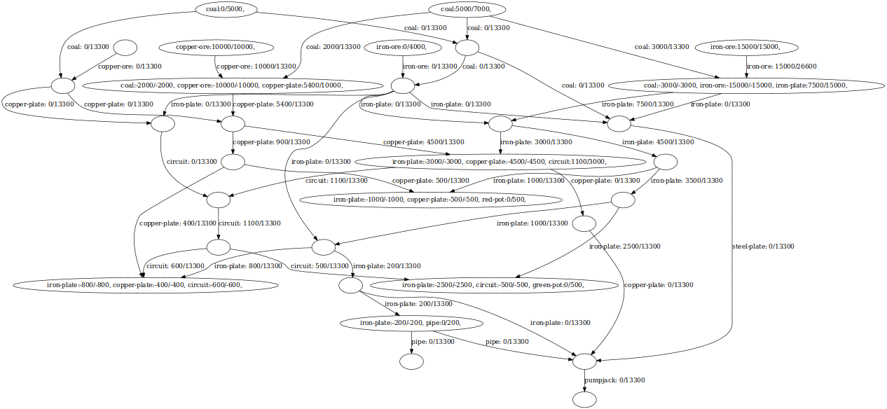
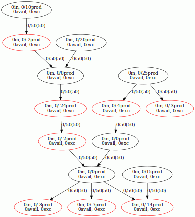

Production flow optimizer
=========================

What is this?
-------------

An attempt to optimize over production flow graphs, e.g. for game
[Factorio](https://factorio.com). This is meant to be used in the 
[factorio bot](https://github.com/Windfisch/factorio-bot) I'm  working on.

This is still in a very early state of development. Optimisation seems
to work, but lacks some testing and proper visualisation

Usage
-----

This is not really usable yet.

### for flow calculation

Checkout revision `14e9e645`, build with `make`, run with `make graph.pdf`,
then open `graph.pdf` in your favourite pdf viewer. Graphs are currently
generated to stdout using the [graphviz](http://www.graphviz.org/) tool **dot**.

(Note that in the current master, the output is cluttered, so this will
not work. Also, the test graph is different now.)

### for flow optimisation

With the current master, build with `make`, run with `./main input/demo.tgf`.
For a detailed description of the output, refer to [doc/output.md](doc/output.md).

### input file format

Factories are read from `.tgf`-files; I use the
[yEd](https://www.yworks.com/products/yed) graph editor to create them,
but you can also write them by hand. The format is simple and described
in the [Wikipedia](https://en.wikipedia.org/wiki/Trivial_Graph_Format).

**Nodes** model *facilities*. The node text must either be empty or in the
format `type curr/max`, where `type` is a facility type like `coal`,
`iron-ore` etc, and `curr` and `max` are floating point numbers denoting the
current and maximum production capacity.  See
[`read_factory.cpp`](read_factory.cpp) for a definition of these types.  Empty
text will create a splitter-like node.

**Edges** model *transport lines*. The text must be in the format
`item length`, where `item` is an item type, and `length` is the physical
length / cost of a transport line. Currently, all transport lines have the
same upgrade plans, only the cost depends on the length. (Hard coded in
`read_factory.cpp`)

Screenshots
-----------

Below are three visualisations of different stages in the production graph
flow calculation. (From rev. `14e9e645`)

How does it work?
-----------------

### Production graph construction

The production graph consists of **facilities** as nodes, and **transport
lines** as (directed) edges.

- **Facilities** *create or consume* certain items at certain rates per second.
  However, empty facilities can also exist, which serve as *fair splitters*,
  meaning that they split the incoming item stream(s) equally over the outputs.
  If one of the output lines stalls because the items are not consumed fast
  enough, the surplus is distributed evenly over the other outputs.

- **Transport lines** have an associated *capacity*, limiting the item rate
  that can be transported over the edge per second.

If a facility produces more items than can be consumed (either because not
enough consumers are available, or because the transport edges to the
consumers are underdimensioned), they are discarded. While this means that at
the facility in question, the production rate of the item is reduced, the
facility still consumes or produces the other items at their original rates.
This is different from the Factorio logic, where dependencies between output
items might occur. (See the Problems section for details)

Both facilities and transport lines have **upgrade plans**, with associated
costs. For facilities, an upgrade increases both production as well as usually
demands, for transport lines, an upgrade increases the flow rate.

In terms of factorio, an upgrade would equal to placing new assembling
machines or upgrading belts to faster belts.

For now, for every item type I, a different production graph is considered
(containing only I-edges, and facilities producing or consuming I).

### Optimisation

Adding new nodes to the graph can cause item shortages. The goal of the
optimisation is to fix them, by either adding new edges / facilities, or by
upgrading them. Without loss of generality we can restrict outselves to
upgrading only, because "adding new edges / facilities" can be seen as
"upgrading those edges / facilities from an (artificially introduced) upgrade
level 0".

#### Definitions

- The production graph is called **valid**, if the simulated flow satisfies all
  item demands.
- **Edges** are called **upgradeable**, if their actual flow of an item equals
  their current flow capacity *and* if the actual flow is less than their
  maximum flow capacity when upgraded.
- Similarly, **nodes** are called **I-upgradeable** if for an item **I** which
  they produce, their current output of I is equal to their current capacity,
  but below their maximum capacity of I when upgraded.
- Some item types I are said to be **more basic** than others J, if J can be
  made out of I.

#### Actions
On an **invalid** production graph, the following actions can be performed:

  - an upgradeable edge for an item I can be upgraded by one level, **iff**
    the currently considered item type equals I
  - an I-upgradeable node can be upgraded by one level, **iff** the currently
    considered item type equals I
  - the currently considered item type can be changed, **iff** the new type
    is **more basic** than the old type

In other words, we will first upgrade bottlenecks of an "advanced" item,
possibly creating bottlenecks in their required inputs. Then we will change
the item type to the "more basic" type, fixing the bottlenecks there. Possibly
going down several levels.

To solve the optimisation problem, a
[Dijkstra-Algorithm](https://en.wikipedia.org/wiki/Dijkstra%27s_algorithm)
will search over the **action graph** that is induced by the aforementioned
actions.

The **action graph** consists of:

  - **nodes**: the currently considered item type, and the set of upgrade
    levels of all facilities and edges in the production graph. Two nodes
    compare equal, if their contained production graphs for all items that are
    **same or more basic** than the currently considered item type are equal.
    (I.e., we ignore all differences in the more advanced items)
  - **edges**: the actions as mentioned above, with associated costs that can
    be calculated from the upgrade plans.

All nodes that have an overall-**valid** production graph (for all items), are
considered **goal** nodes.

The output will thus be the most cost-efficient factory upgrade plan to
satisfy all demands.

Problems
--------

- Items are ordered using the *more-basic*-relation. However, this relation is
  not necessarily well-defined: There could be cyclic crafting recipes in
  Factorio, e.g. "1 Soil + 1 Dung -> 2 Soil". The current solution is to
  ignore the problem.
- The assumption that a facility that stalls on one of its outputs will
  continue to produce its other output items does not hold true. For example,
  for Factorio's refineries, *petrol gas* production will halt if *light/heavy
  oil* is not consumed. This could either be dealt with outside the scope of
  this optimisation process, or we introduce an artificial item that models
  "consumption of an item". Meaning that not only refinieries supply *light
  oil* for chemplants, but also chemplants supply *consumption of light oil* to
  the refineries in exchange. (Steam engines, which destroy the light oil, can
  supply this "consumption" as well.)
- The algorithm complexity is exponential in the number of possible upgrades.
  I hope that this will be fine, because that number will be quite small. If
  this turns out to be a problem, we can use the following heuristic:
  When at least **n** nodes in the action graph with *current-item-level* **L**
  have already been explored, then we strip all nodes with a level greater than
  **L+2** (or any other positive number) from the openlist. We no longer can
  guarantee to find the optimal solution then, but it's probably still quite
  good.
